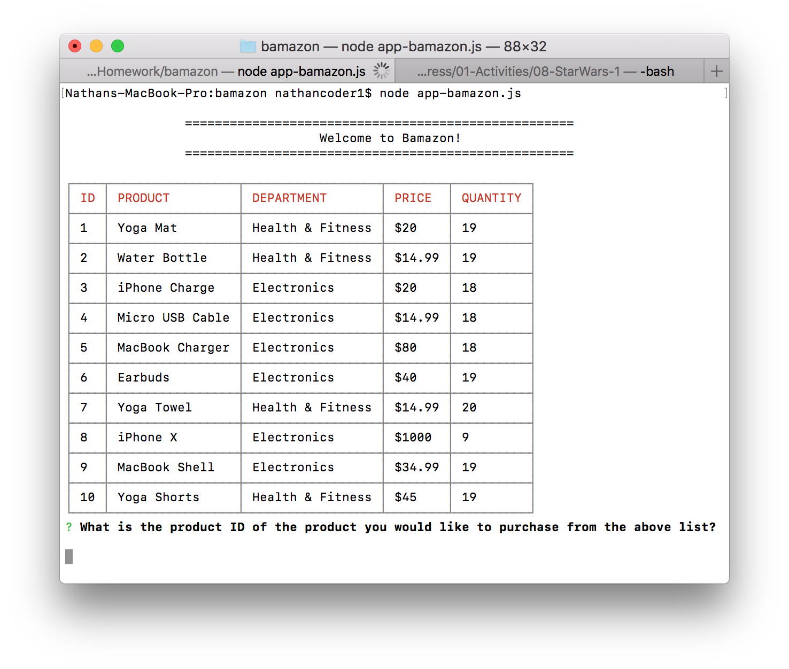
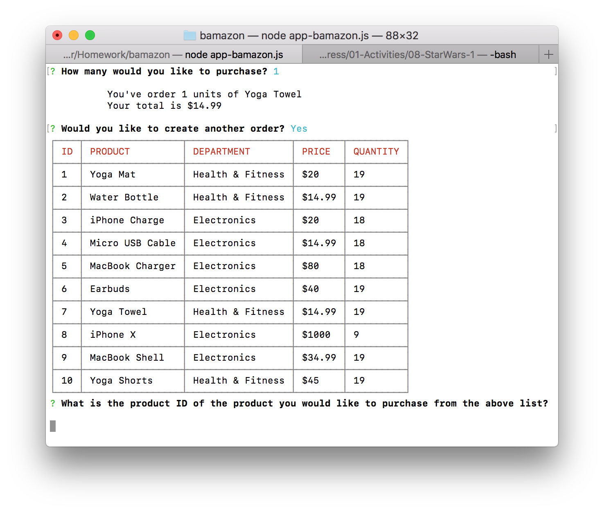
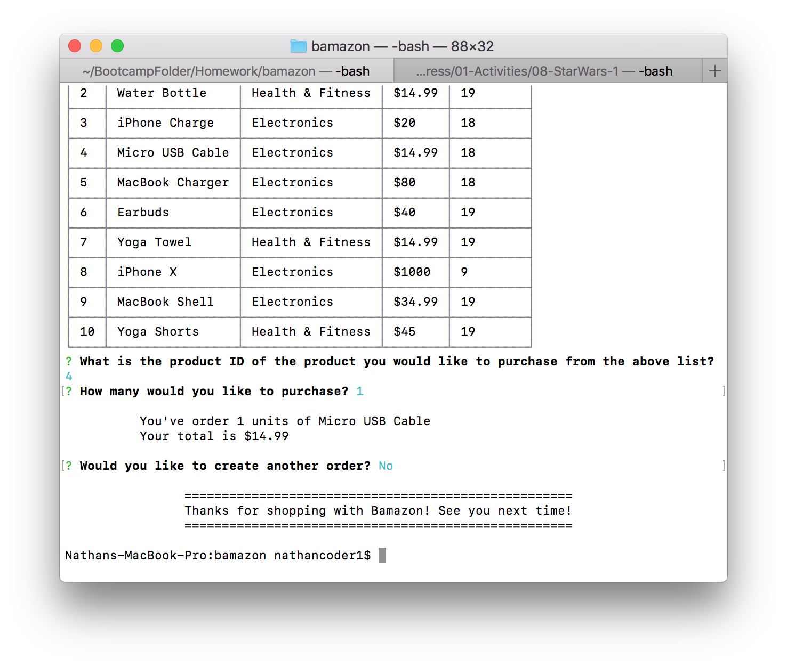

# Bamazon

Bamazon is a command line application that mocks an online marketplace. Users can make fake purchases based on the products and quantities available. 

User needs to merely run *app-bamazon.js* with node, install the required packages, and follow the prompts.

First, a list of available products will appear.

The user follows the prompts to decide the order they want to place.

MySQL is updated, and user can decide to place another order...

Or to end the application.
